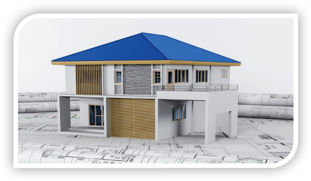

Have you ever thought of buying a house? If yes, I know there are factors that you may have considered. If not, this is your high time to think about buying one. Just don’t continue renting. You can save some extra money and plan how you can get yourself your dream house. I know you will love this article. Here are some tips to consider before buying a house.

## The Structure of the House

Before you buy a house, you need to ask yourself what kind of a house do I want? There are several types of houses you may choose. There are bungalows, cottage, apartments and ranch. When you have this in mind, you will be able to make a good decision to buy your dream house.

## How much can you afford?

Do you know why am asking you this question? This is because I understand that people earn differently. This does not mean that because you a middle class or low-class individual, you can’t afford to buy a house for yourself or your family. For instance, you can decide to invest in a mortgage. As long as the interest rates are low, it can be the best deal I would encourage you to go for. It may take a couple of years but it is worthwhile.

## What is your profession?

When I mean profession, I don’t mean to judge anyone who is employed. Generally, what do you do for a living? Are you stable enough? If you are servicing a loan, will be able to pay it even when you have insufficient funds? These questions should linger in your mind every time an idea clicks in about buying a house.

## Calculate on Your Budget

Every individual deserves to have a budget. Even our county has a yearly budget. It helps in effective planning. That is debit and credit. This budget will help you to cater for your expenses, savings and miscellaneous. House taxes, insurance, home utilities and amenities should also be included in your budget. In short chew what you can swallow which means just live by your means. It will save you from a lot of problems.

## Geographical Location of Your House 

Who wouldn’t prefer a house that is well geographically located? This is a major factor to consider. The house should be located in a well-developed area which has all the required amenities i.e. health care, educational institutions and shopping centers. All this will be determined by your taste and preference because what you may like, gives migraine to another person and vice versa.

## Your Status

Many of you are somehow confused by what I mean when I say status. It is not about your health status. It is about your personal self. Are you single? are you married? If yes, how many children do you have? You cannot buy a one-bedroom apartment when you have two or more children, hence you need to evaluate yourself on that. Go for a bigger, accommodative house.

## Lifespan of the House

Depending on the house you want to buy, it is always wise to consider its age. The house may be very old but very attractive. As they always say old is gold. You may decide to choose that one because of the vintage thrills it may have However you may also choose a house that is newly built because it has modernized and latest finishings. Though from my own experience age is just a number.

## Conclusion

The floor is yours. Don’t panic. You can now go and buy your new house and thank me later