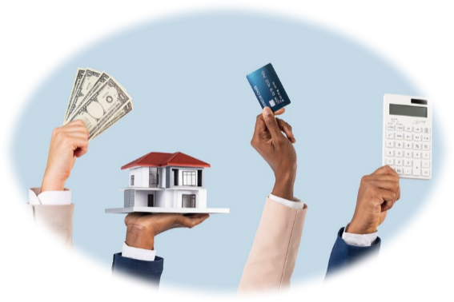
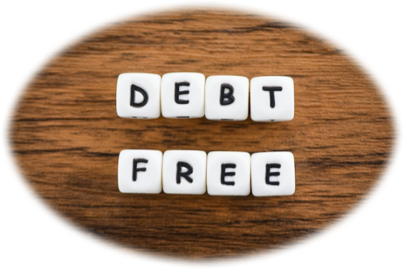

import imageChelseaHagon from '@/public/assets/realtor-1.jpeg'
import cover from "./image-1.png"

export const article = {
  date: '2024-07-05',
  title: 'Things to Avoid When Buying a Property Through Banks Finance',
  coverImage: cover,
  tags: ['Market Trends','Investing', 'Finance'],
  description:
    'Lets highlight the best financial decision you can make when investing through banking finance and get the best of value at the end.',
  author: {
    name: 'Jim K',
    role: 'Interior Designer & Property Researcher',
    image: { src: imageChelseaHagon },
  },
}

export const metadata = {
  title: article.title,
  description: article.description,
}

Bank finance is a process whereby you involve a bank to purchase a property for you. Middle class people are basically the major target when it comes to this. They have conditions as to how you are supposed to repay them. It depends on the price of the property and the number of months or years set to clear the debts. However, there are certain things that you should avoid when it comes to bank finance.

## Do Not Set Goals You Can’t Achieve

Before you decide to go through bank finance, it is always wise to know your targets. This is achieved by setting your objectives and making sure they are fulfilled. If it is loan repayment, make sure that your sources of income generate enough cashflow to settle the debts on time without much struggles.

## Separate Your Emotions with Investments

What do I mean when I say do not invest your emotions in business? Let me elaborate this. When it comes to investment just focus on your capability. This is achieved by making sure that you can chew what you can swallow. This is by asking the bank to finance what you can be able to pay with ease rather than what attracts your eyes.

## No Impulse Purchases

This is an incident whereby you purchase assets like cars, running businesses. When a bank decides to finance you on a certain property, they will go through your bank statements meaning there will be less money in your account. This will lead to finance you a lesser quality property because your financial history is not appealing.

## You Should Not Have a Fluctuating Bank Account

I know many of you asking what is a stagnant bank account. This is a process whereby your bank account neither receives not removes large amounts of money. This is because the bank will have a lot of questions as to where you received the cash or the reason as to why you are taking such large amounts of money. They may have doubts and decline to finance the property you are intending to buy.

## Do Not Stuck in Debt

This is a major factor that a bank always considers before they decide to finance you. When you have no debts, there is a higher chance, that the bank will finance you because they have enough trust that you will repay back their loan that they gave you. It also builds your statement history hence great relationship between the two parties, which is you bank and the bank.

## Resist to Borrow a Loan with Other Parties

Why should I not collaborate with other parties while taking a loan yet it is a great idea? I advise you not do that. This is because the bank will need to know the other party and the reason why you collaborated. If the other party defaults to pay the loan, you will be immensely affected. This will ruin your chances of bank financing.

## Do Not Let Your Publicity Overcome Your Image

The bank tends to trace your financial stability. This is by checking your profession. It is highly recommended that you should not start a business, leave a job or be employed. Stay at your current position of work. The bank will gain confidence and will bank finance the property.

In conclusion bank finance is a great idea that I would advise everyone to be part of. It gives you a platform to be diverse in terms of decision making. By avoiding all this challenges, the bank will be of great pleasure to serve you.