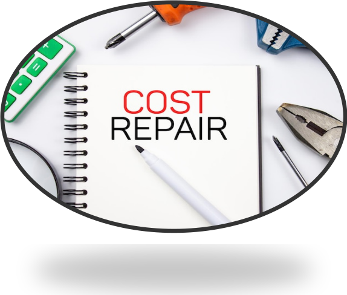
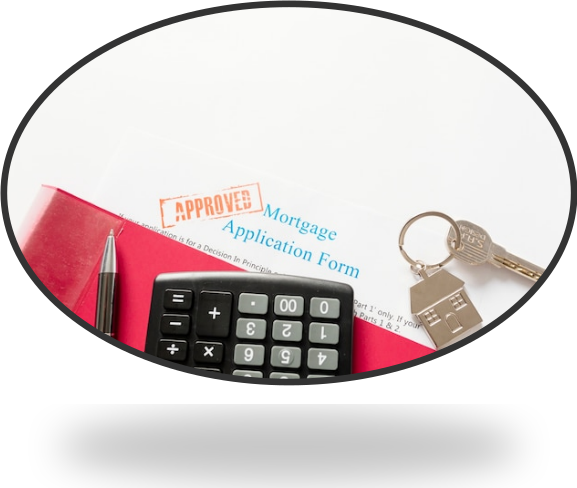
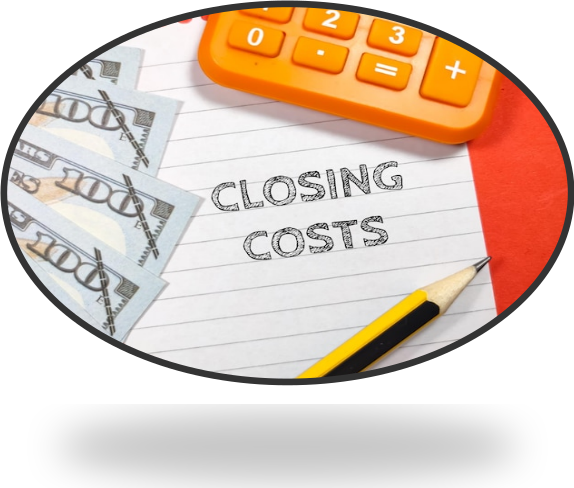
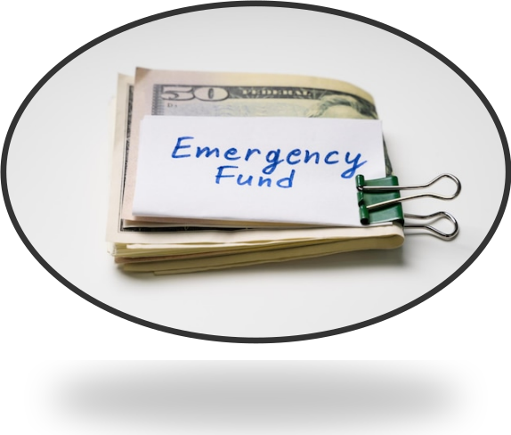

import imageChelseaHagon from '@/public/assets/realtor-1.jpeg'
import cover from "./image-1.png"

export const article = {
  date: '2024-07-06',
  title: 'What are the Major Hidden Costs in the Real Estate Markets',
  coverImage: cover,
  tags: ['real estate','investing'],
  description:
    'Before making any decision in transacting in real estate market it is best advised to keep hidden costs at your finger tips.',
  author: {
    name: 'Jim K.',
    role: 'Realtor',
    image: { src: imageChelseaHagon },
  },
}

export const metadata = {
  title: article.title,
  description: article.description,
}

Buying and selling a house is a major investment that every individual should think of doing. It is one of the greatest milestones that can be achieved when you plan and budget your finances properly. However, there are some hidden costs that are incurred when selling or purchasing a home. It is always advisable to know and understand them in order to curb problems and make the right decision when dealing with real estate.

## Repair and Maintenance costs

Either selling or buying a property you should consider the repairing and maintaining cost. These costs occur when you want to renovate your house, repair water sinks, repainting and also cleaning your house. It is highly recommended that you set aside these costs for better planning.

## Utility Costs

Basically, this utility costs come as a result of what you have in your home. Electricity bills, water bills, garbage bills internet services have to be catered for every month. Make sure the budget is well planned for you to pay those occurring bills.

## Mortgage Interest Rates

These are also costs that occur while servicing a loan for instance a mortgage, you will be able to pay it on time in order to avoid penalties that may occur during payments. As always when you need a mortgage you need to offset 20% which helps in insurance. 

## Homeowners Cost

Depending on where the house is located and its size, it will require you to pay home owners insurance in order to protect your investment property from natural calamities such as fire. Hence include this in your monthly expenses.

## Movers Cost and expenses

This extra cost occurs when you hire movers to move you from your previous home to the current one. They may be a bit expensive but they are worth it because they handle your belonging with care. In case of any damage, they are liable for compensation.

## Closing Cost

This is the allocated fee that is paid after a purchase of a property. It ranges from 2%-5% of the purchase cost. It includes appraisal fees, lawyers fee, transfer fees, inspection fee and also title fee. The seller pays all this closing costs.

## Property Cost

Basically, this is the tax that is comes when you purchase a property. The tax varies from the asset value of your property and also where it is situated that is the local tax area rate. The more expensive the asset the hire the tax rate.

## Renovating and Furnishing Costs

When you move into your new house, it may not be appealing as you would want it to be. Therefore, you are required to make changes that suits your preference and taste. You may decide to have wall decors on the walls, you may change the furniture sets. All this will incur an extra cost

# Security Cost

Everybody wants to feel safe in their new place of living. Therefore, security should start with you. You may decide to install CCTVs, have door alarms and bells for enough security in your home. All these installations come with cost which you will need to pay monthly.

## Miscellaneous and Emergency Costs

You will only need to use this emergency cost when something unavoidable happens. The security system may not be functioning, the water heater may not heat water. All this will need to be attended with extra cost.

In conclusion, everything comes with a price. A great lavish life needs to be maintained. You will incur extra cost. However, make sure you understand these hidden costs for the sake of your own sanity.

