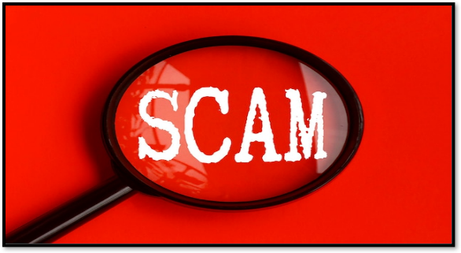

import imageChelseaHagon from '@/public/assets/realtor-1.jpeg'
import cover from "./cover.png"

export const article = {
  date: '2024-07-05',
  title: 'What to Avoid in Order to Evade Scammers in Real Estate',
  coverImage: cover,
  tags: ['Market Trends','Real Estate News'],
  description:
    'Currently, real estate sector is among the leading investments that has most scammers. Due to high returns the sector is a hot spot for criminals and fraudesters.',
  author: {
    name: 'Jim K',
    role: 'Interior Designer & Property Researcher',
    image: { src: imageChelseaHagon },
  },
}

export const metadata = {
  title: article.title,
  description: article.description,
}

Just like any other business, the real estate sector in fact this among the leading investments that has scammers. They are really well informed and use high end technologies to con people. Basically, they con landlords, tenants and investors I don’t want you to be part of being conned and I would like to take you through on ways of how to evade scammers.

## Never Give out Personal Information

When you decide to buy or sell a property it is always advisable to play lowkey. Your personal information should be confidential.

## Identify the Real Estate Company 

Scammers in most cases don’t have a specific location. Unlike genuine people, they would want all the transactions done through the phone. Every straight and legit transaction, or even money transfer will be done one on one and in an office. This will build trust and create good relationship between the two parties.

## Do Not Be Rushed or in a Hurry.

Unlike in every legit business, scammers would not give you time to go through the document, consult your lawyer or do the due diligence of searching the property being bought. They would always show you how urgent it is for you to invest because if you don’t there are other people who are competing with you and are also giving a better offer 

## Avoid Cash Transactions.

One of the easiest ways to lose a lot of money, is through cash transaction. Most of the people who lose their money through scammers have no way of proving they gave out the money. 
once scammers realize you are using either mobile or bank transfer, they will be hesitant to do business with you.

## Go to Site Visit

This is another way that people lose money. Many individuals make mistakes by assuming that transactions can be conducted without knowing the area where the property is situated. Site visits allows the buyer to choose and compare varieties before deciding what to purchase.

## Avoid Silence and Ask the Burning Questions.

Basically, it is always wise to be observant, and do your own research when it comes to real estate. At times most investors get intimidated and fail to ask burning question which later on turn out to being scammed. Therefore, do not hesitate to ask any question you feel like it should be answered.

## Avoid Emails Scams an Unnecessary Phone Calls

Sometimes, emails and phone calls can be very convincing. Scammers are very high tech and skilled personnel’s, who may call you and act as agents of certain real estates firms. They may send you fake emails relevant information after they have conducted thorough research about your personal background which makes you think that they are genuine real estate companies. Stay safe. They are not.

## Avoid Going Alone and Create a Good relationship With Your Lawyer

In order to avoid being scammed, it is always advisable to be with someone close, someone you trust, i.e., your lawyer who may be involved in filing a case in case of any complaint. These lawyers also help you in decision making in case you don’t have enough knowhow concerning real estate.

As I conclude, real estate is the best sector to invest in. It may have high risks but has high returns. In order to succeed, the above tips will help you to avoid being scammed by this con people.